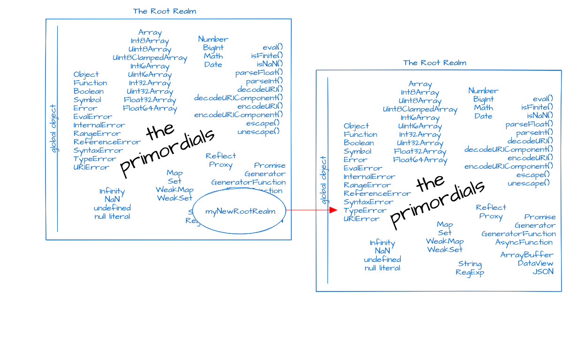
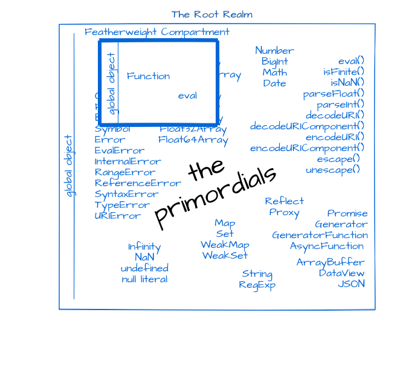
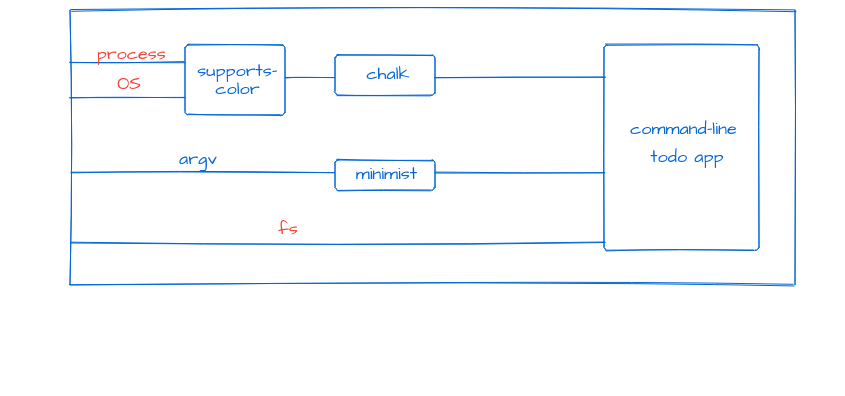

# Safe JavaScript Modules

by Mark S. Miller, Darya Melicher, Kate Sills, JF Paradis

## Introduction

The [event-stream
incident](https://blog.npmjs.org/post/180565383195/details-about-the-event-stream-incident)
showed that using third-party modules leaves application
developers widely vulnerable to malicious attacks. This proposal
outlines a significantly safer way to write and load modules, to the
point of preventing similar malicious attacks entirely.

The goal of this proposal is enforce the [Principle of Least Authority
(POLA)](https://agoric.com/references/#pola) on all imported modules,
meaning that the modules should only be given the authority that they
need to accomplish their tasks and no more. To accomplish this goal,
we must be able to isolate modules from each other, and to cut off
access to powerful resources such as the file system or network,
except as legitimately needed.

## Realms

Most people don't realize it, but JavaScript already has a very useful
concept for code isolation: a *realm*. A realm is, roughly, the
environment in which code gets executed. For instance, in a browser
context, there is one realm per webpage. Thus, for a long time, one
way of isolating third-party JavaScript was to isolate it in a
same-origin iframe. But using iframes is clunky, and being able to
create new realms without having the overhead of creating new webpages
would be a major win for code isolation.

The [tc39 proposal Realms](https://github.com/tc39/proposal-realms) is
an API for explicitly creating and manipulating such realms. Thus,
the Realms API is the foundation of our plan for safe modules. 

## How the Realms API works


To be precise, a realm consists of:

   * The set of objects that must exist before code starts running.
     These objects, such as `Object`, `Object.prototype`, and
     `Array.prototype.push`, are called the *primordials*
     [[1](#1)]. 
   * A global object, global scope, and global lexical scope. When
     code uses a variable name that it does not define, the variable
     name is looked up in these containing global scopes.

Creating a new root realm creates a new set of
primordials as well as a new global object and global scope. 



A root realm can be an almost perfect sandbox. At the moment of
creation, the creator of a root realm has the only reference into the
root realm. The root realm is otherwise fully isolated from the rest
of the world. It has no ability to cause effects to the world outside
itself. Aside from the grandfathered-in exceptions of `Date.now()` and
`new Date()` (see below), it has no abilities to sense effects from
the world outside itself. Malicious code loaded into an isolated root
realm cannot do any significant damage. However, with the Realms
proposal alone, there is no practical way to interact safely with such
potentially malicious code.

The code that creates a new root realm can add its own objects to that
root realm's global, providing initial authority of its own design to
the code that will run in that root realm. In this way, we enable some
JavaScript code (that creating and customizing a root realm) to act as
an arbitrary host to other JavaScript code (that running within the
root realm). To the code within the root realm, these authority
bearing objects that it finds in its global scope are as-if its host
objects. Using the realms API, code on any platform can run other code
within an emulation of any other platform.

### Featherweight compartments

The Realms API allows you to create another type of realm, known as a
*featherweight compartment*. Rather than duplicating its root realms'
primordials, a featherweight compartment shares them, making it much
lighter than creating a new root realm. While it shares the
primordials, each featherweight compartment has its global object,
global scope, and its own named evaluators, the `eval` function and
the `Function` constructor, that evaluate code in that compartment's
global scope.



A root realm can contain many co-existing featherweight compartments.
However, with the Realms proposal alone, these compartments are not
protected from each other. They share the same primordials provided by
their common root realm. Because all primordials start mutable, code
in any of the compartments can engage in *prototype poisoning*,
corrupting the shared primordials that code in other compartments rely
on.

## SES

To that end, we built [Secure EcmaScript
(SES)](https://github.com/agoric/ses) on top of Realms. SES hardens
the root realm such that all the shared primordials are transitively
frozen, transitively immutable, lack any I/O abilities or abilities to
cause or sense any state outside themselves.

However, while SES provides security, SES does not yet incorporate a
module system that easily allows for code reuse. This document
outlines a plan for a module system that is easy to use and secure
enough to prevent incidents like the event-stream exploit.

## Threat Model

We follow the threat model as described in the Wyvern paper [[2](#2)],
including two common scenarios: malicious third-party code and
fallible in-house code. Node.js currently has no protections against
malicious third-party code -- seemingly simple packages can access the
entire files system and send our data off to anywhere. Fallible in-house
code is also a worry. For instance, we might be concerned that our own application
will overwrite an important file if misconfigured.

## Pure and Resource Modules

Our proposal depends on the idea that some modules can be identified
as intrinsically safer than other modules. For instance, a module that
doesn't have access to the file system can't do as much damage as a
module that *does* have access. We therefore define two kinds of
modules: **pure modules** and **resource modules**. These names come
from the Wyvern programming language [[2](#2)], which features a
capability-based module system. (One of the main contributors to
Wyvern, Darya Melicher, is one of the authors of this proposal.) We
adapt Wyvern's definitions as follows:

**Pure values** (pure objects in Wyvern) are values that (see the
detailed [definition here](./DEFINITIONS.md)):

1.  do not encompass system resources (i.e. network access),
1.  do not contain or transitively reference any mutable state,
1.  have no side effects.

**Pure modules** are those modules that [[3](#3)]:

1.  do not encompass system resources (i.e. network access),
1.  do not contain or transitively reference any mutable state,
1.  have no side effects,
1.  do not import any resource module,
1.  only export pure values, and
1.  declare themselves to be pure.

**Resource modules** are defined as modules that either:

1.  encapsulate system resources,
1.  contain mutable state,
1.  have side effects,
1.  use other resource modules, or
1.  export non pure values.

For example, the popular `request` package would be a resource module
because it imports Node's core `http` module which gives access to the
network.

From these definitions, it follows that pure modules can only import
other pure modules. If a module imports a resource module instance it
gets automatically categorized as a resource module itself, even if it
would otherwise be pure.

In addition, we can define a SES root realm as a realm that only
encompasses pure values.

## Loaders

Our distinction between pure and resource modules allows us to treat
them differently. Verifiably pure modules can be loaded into a SES
root realm together and shared with all its compartments without a
loss of security. Resource modules, however, (and this includes
everything that is not verifiably pure), provide the ability to cause
or sense effects, and thus must only be provided by explicit
authorization to that code which legitimately needs access to it.

To accommodate both of these needs, we associate a shared *pure
loader* with a root realm, which only loads pure modules. We associate
a *resource loader* with a compartment. Code loaded by a compartment's
loader will evaluate in the scope of that compartment, and will import
according to that compartment's loader. Loaders are configured to
delegate imports to other loaders within limits and via renaming.
Thus, importing `'foo'` within compartment `X` might import `'bar'`
from compartment `Y`, loading `'bar'` in compartment `Y`. Thus, code
loaded within compartment `X` can import something exported by code
loaded into compartment `Y`. We can take modules meant to be linked
together in a conventional sense, and instead link them together
across compartments within a shared root realm.

The pure loader will only load modules that have been statically
verified to be *purifiable*. A module is purifiable, if, under the
assumption that all values it imports are pure and the all values it
exports get hardened (see below), then all values it exports are pure.
For example, the following module is verifiably purifiable:

```js
let x = require("x");

function foo(y) {
  return [x, y];
}

exports = {x, foo};
```

SES provides a `harden` [[4](#4)] function (see
[@agoric/harden](https://github.com/Agoric/Harden#harden) for more
information), which performs a transitive walk over *own properties*,
i.e., properties that are not inherited, freezing every object it
encounters. Harden additionally verifies that the objects that these
objects inherit from are themselves already hardened. The pure loader
will apply harden automatically to all exported and imported values.
For example, the pure loader would effective apply harden at the
following points, while also guaranteeing that `x` is pure.

```js
let x = harden(require("x"));

function foo(y) {
  return [x, y];
}

exports = harden({x, foo});
```

Given the use of harden and the assumption that module "x" is also
verifiably purifiable, the above module is a pure module.

## Access Control and Wiring

At this point, we have pure modules together in the root realm and
resource modules in their own compartments. However, we have not yet
described how these modules may be used, or how access to dangerous
resources can be granted. There are two ways in which access control
is specified in our proposed system: a manifest and authority-handling
modules. A manifest is associated with a group of modules, or
`package`, and can be thought of as similar to an npm package's
`package.json` file. A manifest is declarative, and can express how
packages are wired to each other, but can't fully express complex
authority decisions. Complex authority decisions are best expressed in
code, in authority-handling modules. In these modules, the
application's authority can be subdivided, attenuated, or virtualized.

## Concrete Example: Command Line Todo App

To explain how this would work, let's use an concrete example. Let's
say we are writing a command-line todo app. We can input and display
tasks (we will ignore deleting tasks for now), and the task data is
saved to a file. Our todo application runs on Node.js and imports the
[chalk](https://www.npmjs.com/package/chalk) and
[minimist](https://www.npmjs.com/package/minimist) packages, two of
the [most widely used npm
packages](https://www.npmjs.com/browse/depended).  Chalk displays our
todo list in various colors based on the task's priority, and Minimist
parses our command line arguments for us.

[Minimist](https://github.com/substack/minimist/blob/master/index.js)
is a pure module because it doesn't encompass any system resources,
doesn't import any resource modules, doesn't contain or transitively
reference any mutable state, has no side effects, and only exports a
function for parsing args. We shall assume in our example that it
declares itself pure. Because minimist is a pure module, minimist is
loaded into the root realm.

[Chalk](https://github.com/chalk/chalk), on the other hand, needs to
know what system it is running on in order to know what colors it can
use, so it imports a package called `supports-color`, which imports
Node's `os` module. The `os` module includes functions that return the
current platform and release. It also includes a function to set the
scheduling priority of any process. Because of this, the `os` module
is a resource module. And, because chalk transitively imports the `os`
module, it is also a resource module.

There are two distinct approaches that can be taken to use these
modules securely. First, we can rewrite the modules such that the
dangerous resources are passed in as a parameter and we can pass in
virtualized or attenuated versions instead. Thus, `chalk` exports a
function that has parameters (`os`, `process`) and in turn passes
these on to `supports-color`. The second approach, the legacy
approach, doesn't require a rewrite of the packages. Instead, a
manifest details the wiring that should occur. For instance,
`supports-color` shouldn't get the actual `os` module, but rather an
attenuated version that drastically limits the properties available.

Both of these approaches may be used simultaneously in the same code
base. Modules that can be rewritten in the functional style are
preferred, but we assume that given the vast number of JavaScript
packages, we need to be able to use legacy code as well.

We've created repositories that contain an example for both of these
approaches.

### Functional Approach

([Working repository "clean-todo" here](./examples/clean-todo))

The functional approach is the most straightforward. Our todo app
functionality uses three dangerous resources: the built-in node
modules (`fs` and `os`) and the global variable process. It uses `fs`
directly and `os` and `process` through chalk.



By default, only the todo app itself has access to the build-in node
modules and global variables. By using SES to provide featherweight
secure compartments for loading modules, at this point, chalk and
supports-color are loaded in their own compartments and do not have
any access to `os` and `process`. We need to figure out how to grant
access selectively and securely. Chalk, being a third party module,
fits the threat model of possibly malicious third party code.
The direct use of `fs` by our todo app fits the threat model of
fallible in-house code. Furthermore, this example contains both
resource modules and global variables, allowing us to show how to
handle both.

Let's start with a working version using current Node.js. The file
starts like this:

```js
const fs = require('fs');
const parseArgs = require('minimist');
const chalk = require('chalk');
const todoFile =  'todo.txt'
const addTodoToFile =  (todo, priority='Medium')  =>  {
  fs.appendFile(todoFile, `${priority}: ${todo} \n`,  (err)  =>  {
    if  (err)  throw err;
      console.log('Todo was added');
    });
  }
  ...
```

The first step we need to take to enforce POLA is to attenuate the fs
module. By attenuate, we mean reducing the authority to only what is
essential. We can create a new module `attenuate-fs` to do this:

``` js
const harden = require('@agoric/harden');
const todoPath =  'todo.txt';
const checkFileName =  (path)  =>  {
  if  (path !== todoPath)  {
    throw Error(`This app does not have access to ${path}`);
  }
};

const attenuateFs =  (originalFs)  => harden({
  appendFile:  (path, data, callback)  =>  {
    checkFileName(path);
    return originalFs.appendFile(path, data, callback);
  },
  createReadStream:  (path)  =>  {
    checkFileName(path);
    return originalFs.createReadStream(path);
  },
});

module.exports  = attenuateFs;
```

Now, instead of using the original `fs` when we try to append a todo,
we can use an attenuated version that will error if we try to 1) use
any `fs` functionality other than `appendFile` and `createReadStream`, or 2)
if we try to call these methods with any file other than our
predefined todo.txt file. The attenuated version looks like this:

```js
const fs = require('fs');
const parseArgs = require('minimist');
const chalk = require('chalk');
const attenuateFs = require('attenuate-fs');
const altFs = attenuateFs(fs);

const todoFile =  'todo.txt';

const addTodoToFile =  (todo, priority =  'Medium')  =>  {
  altFs.appendFile(todoFile, `${priority}: ${todo} \n`, err =>  {
    if  (err)  throw err;
    console.log('Todo was added');
  });
};
...
```

Thus, we've given our own code the least authority version of the file
system - only the one file and only certain functions with that file.
In a much larger example, attenuation like this can help a great deal
with fallible in-house code that may accidentally misuse authority.

But let's turn to the problem of potentially malicious third party
code. Minimist is a pure module, so we are ok giving it zero access to
the external world and using the pure module loader to check that it
matches our definition of a pure module. Chalk, on the other hand,
needs access to `os` and `process` to do its legitimate job, so we need to
give access to those resources but at the same time, ensure that no
additional access is provided.

We start by rewriting chalk as a function that takes in `os` and
`process`(see
[diff](https://github.com/chalk/chalk/compare/master...katelynsills:master)):

```js
const pureChalk =  (os, process)  =>  {
const stdoutColor = pureSupportsColor(os, process).stdout;
...
```

Now we need to write rewrite supports-color in the same way
([diff)](https://github.com/chalk/supports-color/compare/master...katelynsills:master):

```js
const pureSupportsColor =  (os, process)  =>  {
const  {env}  = process;
...
```

Note that supports-color no longer imports `os` itself and it only has
access to the `os` and `process` passed to it. It has no access to the
`process` variable provided by Node.js.

Now that we are in control of the resources that chalk and
supports-color are using, let's attenuate them before passing them on.
Going back to our todo-app index.js, it would look like this:

```js
// built-in modules
const fs = require('fs');
const os = require('os');

// our rewritten modules
const parseArgs = require('minimist');
const pureChalk = require('chalk');

// our attenuating modules
const attenuateProcess = require('attenuate-process');
const attenuateOs = require('attenuate-os');
const attenuateFs = require('attenuate-fs');

// attenuate
const altProcess = attenuateProcess(process);
const altOs = attenuateOs(os);
const altFs = attenuateFs(fs);
const chalk = pureChalk(altOs, altProcess);

const todoFile =  'todo.txt';

const addTodoToFile =  (todo, priority =  'Medium')  =>  {
  altFs.appendFile(todoFile, `${priority}: ${todo} \n`, err =>  {
    if  (err)  throw err;
    console.log('Todo was added');
  });
};
...
```

And attenuate-os and attenuate-process would look like this:

```js
const attenuateOs =  (originalOs)  =>
  // we know the result is pure
  harden({
    release: originalOs.release,
  });

module.exports  = attenuateOs;
```

```js
const attenuateProcess =  (originalProcess)  =>
  // this is not pure - stdout and stderr are resources
  harden({
    env: originalProcess.env,
    platform:  'win32',
    versions: originalProcess.versions,
    stdout: originalProcess.stdout,
    stderr: originalProcess.stderr,
  });
module.exports  = attenuateProcess;
```

Now, chalk and supports-color cannot use os to do dangerous things
like change the priority of processes.

But what happens if we don't have the opportunity to rewrite the
modules we want to use? Then we can use the legacy approach.

#### Legacy Approach

([example code](./examples/legacy-todo))

In the legacy approach, our todo app code doesn't do the attenuating -
it looks like a normal Node.js app again. We also don't touch chalk or
supports-color. To control the access that chalk and supports-color
have, we instead use a manifest to describe the relationship, and then
our loaders enforce the manifest, including using attenuating modules.
The manifest would look like your normal package.json, but with an
additional property, `resources`:

```json
"resources":  {
  "index": {
    "modules": {
      "fs":  "alt-fs",
      "chalk": true
    }
  },
  "chalk":  {
    "modules":  {
      "supports-color":  true
    }
  },
  "alt-fs":  {
    "modules":  {
      "fs":  true
    }
  },
  "alt-os":  {
    "modules":  {
      "os":  true
    }
  },
  "alt-process":  {
    "globals":  {
      "process":  true
    }
  },
  "supports-color":  {
    "modules":  {
      "os":  "alt-os"
    },
    "globals":  {
      "process":  "alt-process"
    }
  }
}
```

Instead of `fs`, our todo-app index.js is handed the `alt-fs` module
by the module loader. From the todo-app perspective, it thinks it's
getting `fs`, and would only find out otherwise if it goes outside the
bounds of what is provided to it.

`alt-fs` is simply the attenuated version of `fs`, exported as a
module.

```js
const attenuateFs = require('attenuate-fs');
const fs = require('fs');
module.exports  = attenuateFs(fs);
```

We build similar attenuating modules for `os` and `process` - `alt-os`
and `alt-process`.


### Implementation Details 

(In progress)

#### The Manifest

-   Modules: Modules can only import what their manifest says they
    depend on. This is enforced by having no access by default and the
    loader providing the authority designated by the manifest. 

-   Globals: Which non-pure-JS global variable names it uses, i.e.,
    which non-whitelisted variables it uses freely. From the free
    variables in the modules, we can check or generate this part of
    the manifest. The manifest describes which of these variables are
    assigned to.

-   Whether it accesses its global object, i.e., by a top-level this.
    We do not assume that a module that says window freely accesses
    the global object. We treat this as any other global variable
    reference. Currently this is not yet an issue for modules, but may
    become one depending on [tc39
    proposal-global](https://github.com/tc39/proposal-global).

-   Which properties of the global object it uses via property access.
    This cannot be accurately determined statically, but can be
    under-approximated.

-   Which of its modules it alleges are pure and should therefore be
    loaded by the root-realm's pure loader if it is indeed pure. Such
    pure modules are not multiply instantiated and are instantiated
    separately from their package. Thus, modules declared pure do not
    cause identity discontinuities.

## References and Footnotes

<a name="1">[1]</a> Primordials are all of the JavaScript objects that
are mandated by the ECMAScript spec to exist before the code starts
running, but not including the global object. Host-mandated objects,
such as document or require, are not primordials. All intrinsics are
primordials.

<a name="2">[2]</a> A Capability-Based Module System for Authority
Control. Darya Melicher, Yangqingwei Shi, Alex Potanin, and Jonathan
Aldrich. European Conference on Object-Oriented Programming (ECOOP),
2017.

<a name="3">[3]</a> These definitions assume that the module’s exports
are hardened by the loader, and that the module’s imports are
themselves pure as enforced by the loader.

<a name="4">[4]</a> Previous named `def`
